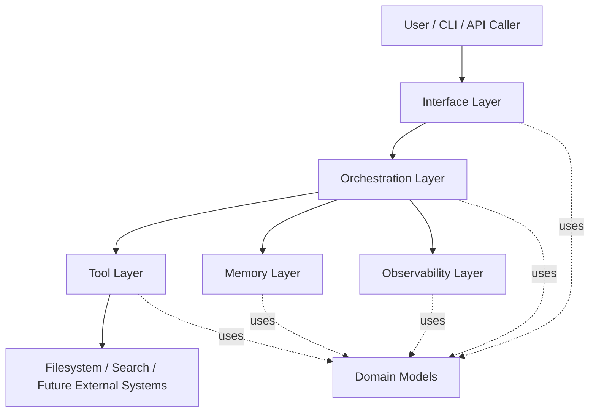
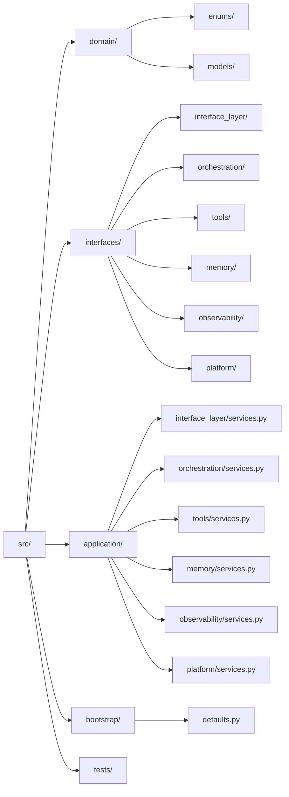
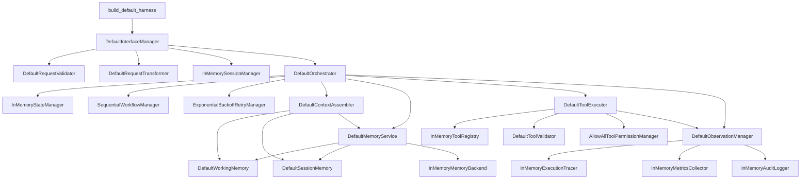
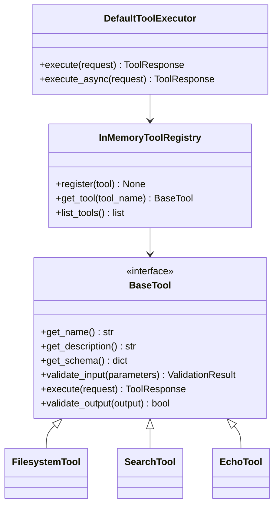

# MVP Architecture Diagrams

## 1. High-level layer architecture

```mermaid
flowchart TB
    User[User / CLI / API Caller]
    Interface[Interface Layer]
    Orchestration[Orchestration Layer]
    Tools[Tool Layer]
    Memory[Memory Layer]
    Observability[Observability Layer]
    Domain[Domain Models]
    External[Filesystem / Search / Future External Systems]

    User --> Interface
    Interface --> Orchestration
    Orchestration --> Tools
    Orchestration --> Memory
    Orchestration --> Observability
    Tools --> External

    Interface -. uses .-> Domain
    Orchestration -. uses .-> Domain
    Tools -. uses .-> Domain
    Memory -. uses .-> Domain
    Observability -. uses .-> Domain
```

## 2. Package structure

```mermaid
flowchart LR
    src[src/]
    domain[domain/]
    interfaces[interfaces/]
    application[application/]
    bootstrap[bootstrap/]
    tests[tests/]

    src --> domain
    src --> interfaces
    src --> application
    src --> bootstrap
    src --> tests

    domain --> enums[enums/]
    domain --> models[models/]

    interfaces --> il[interface_layer/]
    interfaces --> ol[orchestration/]
    interfaces --> tl[tools/]
    interfaces --> ml[memory/]
    interfaces --> obl[observability/]
    interfaces --> pl[platform/]

    application --> ais[interface_layer/services.py]
    application --> aos[orchestration/services.py]
    application --> ats[tools/services.py]
    application --> ams[memory/services.py]
    application --> aobs[observability/services.py]
    application --> aps[platform/services.py]

    bootstrap --> defaults[defaults.py]
```

## 3. Default runtime composition

```mermaid
flowchart TB
    Bootstrap[build_default_harness]
    IM[DefaultInterfaceManager]
    RV[DefaultRequestValidator]
    RT[DefaultRequestTransformer]
    SM[InMemorySessionManager]
    ORCH[DefaultOrchestrator]
    STM[InMemoryStateManager]
    WF[SequentialWorkflowManager]
    RM[ExponentialBackoffRetryManager]
    CA[DefaultContextAssembler]
    MS[DefaultMemoryService]
    WM[DefaultWorkingMemory]
    SEM[DefaultSessionMemory]
    MB[InMemoryMemoryBackend]
    TE[DefaultToolExecutor]
    TR[InMemoryToolRegistry]
    TV[DefaultToolValidator]
    TPM[AllowAllToolPermissionManager]
    OM[DefaultObservationManager]
    ET[InMemoryExecutionTracer]
    MC[InMemoryMetricsCollector]
    AL[InMemoryAuditLogger]

    Bootstrap --> IM
    IM --> RV
    IM --> RT
    IM --> SM
    IM --> ORCH

    ORCH --> STM
    ORCH --> WF
    ORCH --> RM
    ORCH --> CA
    ORCH --> MS
    ORCH --> TE
    ORCH --> OM

    CA --> WM
    CA --> SEM
    CA --> MS
    MS --> WM
    MS --> SEM
    MS --> MB

    TE --> TR
    TE --> TV
    TE --> TPM
    TE --> OM

    OM --> ET
    OM --> MC
    OM --> AL
```

## 4. Tool plugin model

```mermaid
classDiagram
    class BaseTool {
        <<interface>>
        +get_name() str
        +get_description() str
        +get_schema() dict
        +validate_input(parameters) ValidationResult
        +execute(request) ToolResponse
        +validate_output(output) bool
    }

    class InMemoryToolRegistry {
        +register(tool) None
        +get_tool(tool_name) BaseTool
        +list_tools() list
    }

    class DefaultToolExecutor {
        +execute(request) ToolResponse
        +execute_async(request) ToolResponse
    }

    class FilesystemTool
    class SearchTool
    class EchoTool

    BaseTool <|-- FilesystemTool
    BaseTool <|-- SearchTool
    BaseTool <|-- EchoTool
    InMemoryToolRegistry --> BaseTool
    DefaultToolExecutor --> InMemoryToolRegistry
```

