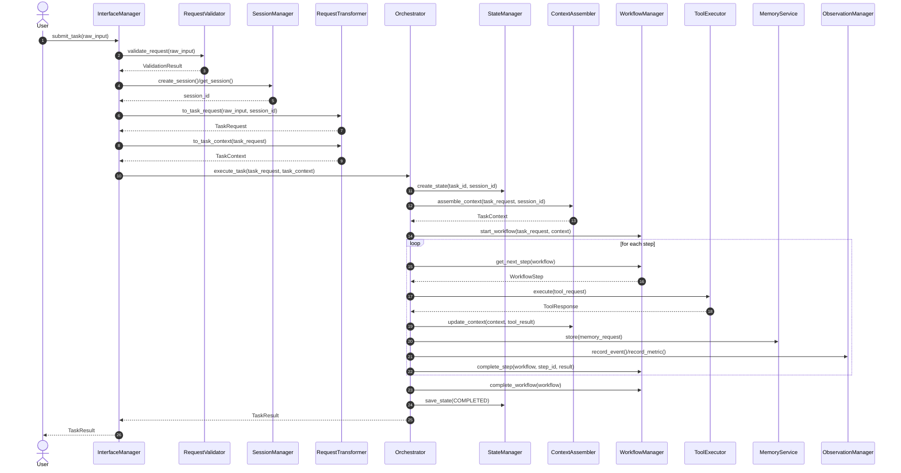
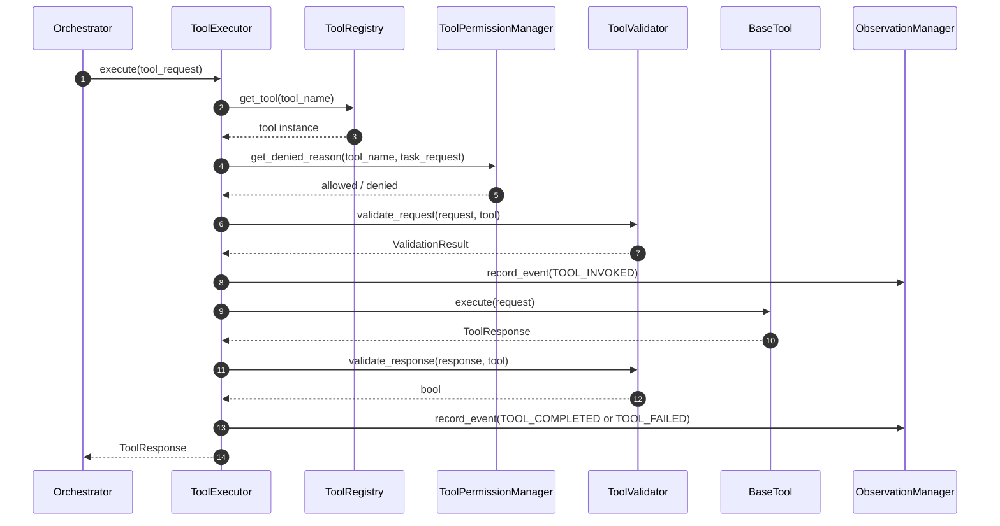
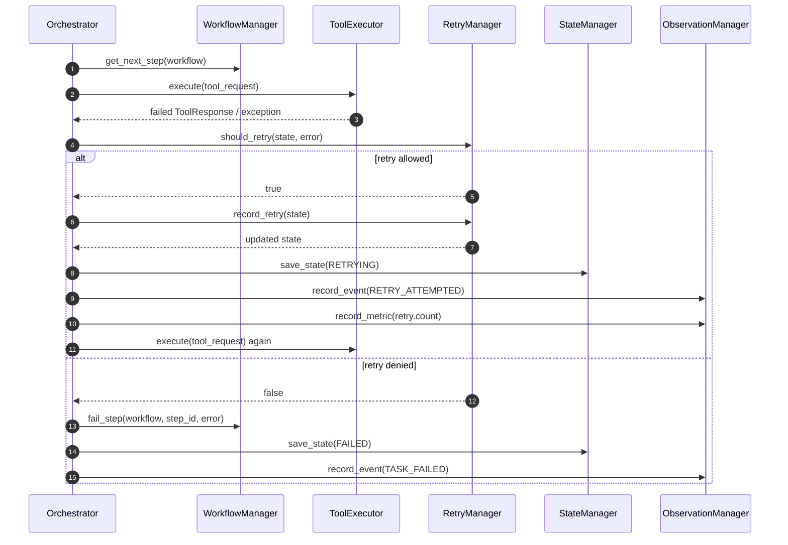
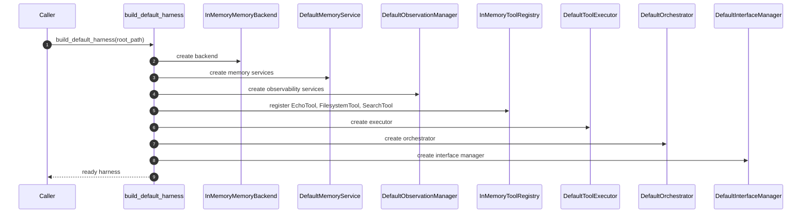

# MVP Sequence Diagrams

## 1. Task submission and execution

```mermaid
sequenceDiagram
    autonumber
    actor U as User
    participant IM as InterfaceManager
    participant RV as RequestValidator
    participant SM as SessionManager
    participant RT as RequestTransformer
    participant OR as Orchestrator
    participant ST as StateManager
    participant CA as ContextAssembler
    participant WF as WorkflowManager
    participant TE as ToolExecutor
    participant MS as MemoryService
    participant OM as ObservationManager

    U->>IM: submit_task(raw_input)
    IM->>RV: validate_request(raw_input)
    RV-->>IM: ValidationResult
    IM->>SM: create_session()/get_session()
    SM-->>IM: session_id
    IM->>RT: to_task_request(raw_input, session_id)
    RT-->>IM: TaskRequest
    IM->>RT: to_task_context(task_request)
    RT-->>IM: TaskContext
    IM->>OR: execute_task(task_request, task_context)
    OR->>ST: create_state(task_id, session_id)
    OR->>CA: assemble_context(task_request, session_id)
    CA-->>OR: TaskContext
    OR->>WF: start_workflow(task_request, context)
    loop for each step
        OR->>WF: get_next_step(workflow)
        WF-->>OR: WorkflowStep
        OR->>TE: execute(tool_request)
        TE-->>OR: ToolResponse
        OR->>CA: update_context(context, tool_result)
        OR->>MS: store(memory_request)
        OR->>OM: record_event()/record_metric()
        OR->>WF: complete_step(workflow, step_id, result)
    end
    OR->>WF: complete_workflow(workflow)
    OR->>ST: save_state(COMPLETED)
    OR-->>IM: TaskResult
    IM-->>U: TaskResult
```

## 2. Tool execution

```mermaid
sequenceDiagram
    autonumber
    participant OR as Orchestrator
    participant TE as ToolExecutor
    participant TR as ToolRegistry
    participant TPM as ToolPermissionManager
    participant TV as ToolValidator
    participant TOOL as BaseTool
    participant OM as ObservationManager

    OR->>TE: execute(tool_request)
    TE->>TR: get_tool(tool_name)
    TR-->>TE: tool instance
    TE->>TPM: get_denied_reason(tool_name, task_request)
    TPM-->>TE: allowed / denied
    TE->>TV: validate_request(request, tool)
    TV-->>TE: ValidationResult
    TE->>OM: record_event(TOOL_INVOKED)
    TE->>TOOL: execute(request)
    TOOL-->>TE: ToolResponse
    TE->>TV: validate_response(response, tool)
    TV-->>TE: bool
    TE->>OM: record_event(TOOL_COMPLETED or TOOL_FAILED)
    TE-->>OR: ToolResponse
```

## 3. Retry path

```mermaid
sequenceDiagram
    autonumber
    participant OR as Orchestrator
    participant WF as WorkflowManager
    participant TE as ToolExecutor
    participant RM as RetryManager
    participant ST as StateManager
    participant OM as ObservationManager

    OR->>WF: get_next_step(workflow)
    OR->>TE: execute(tool_request)
    TE-->>OR: failed ToolResponse / exception
    OR->>RM: should_retry(state, error)
    alt retry allowed
        RM-->>OR: true
        OR->>RM: record_retry(state)
        RM-->>OR: updated state
        OR->>ST: save_state(RETRYING)
        OR->>OM: record_event(RETRY_ATTEMPTED)
        OR->>OM: record_metric(retry.count)
        OR->>TE: execute(tool_request) again
    else retry denied
        RM-->>OR: false
        OR->>WF: fail_step(workflow, step_id, error)
        OR->>ST: save_state(FAILED)
        OR->>OM: record_event(TASK_FAILED)
    end
```

## 4. Bootstrap sequence

```mermaid
sequenceDiagram
    autonumber
    participant Caller
    participant B as build_default_harness
    participant MB as InMemoryMemoryBackend
    participant MS as DefaultMemoryService
    participant OM as DefaultObservationManager
    participant TR as InMemoryToolRegistry
    participant TE as DefaultToolExecutor
    participant OR as DefaultOrchestrator
    participant IM as DefaultInterfaceManager

    Caller->>B: build_default_harness(root_path)
    B->>MB: create backend
    B->>MS: create memory services
    B->>OM: create observability services
    B->>TR: register EchoTool, FilesystemTool, SearchTool
    B->>TE: create executor
    B->>OR: create orchestrator
    B->>IM: create interface manager
    B-->>Caller: ready harness
```
