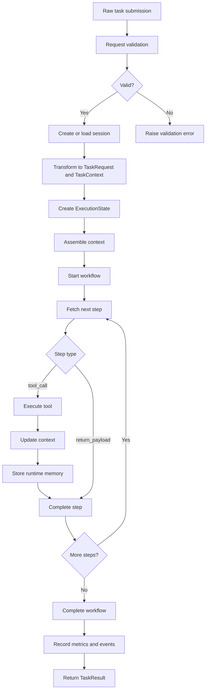
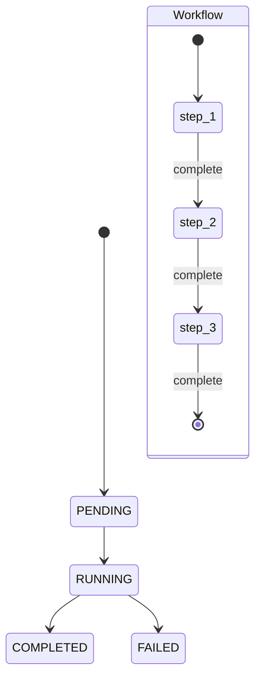
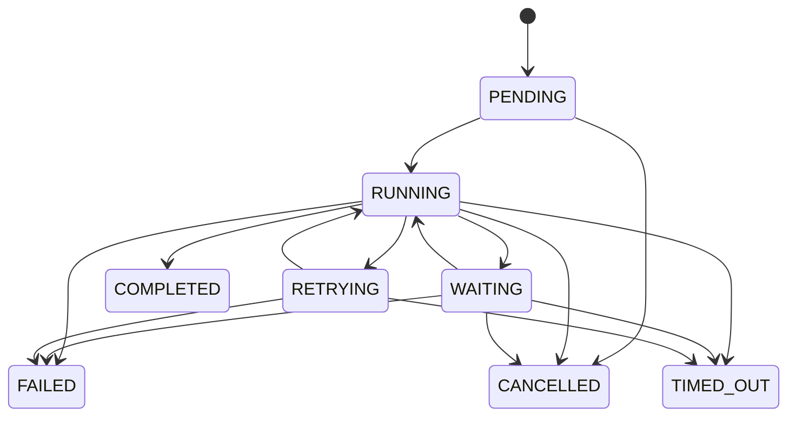
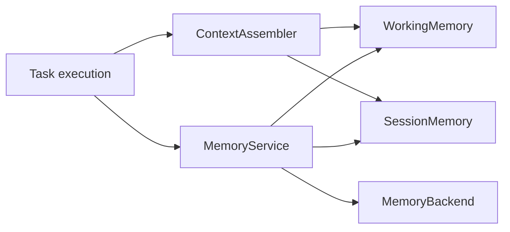
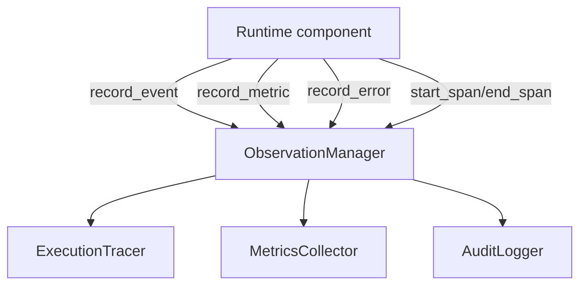

# MVP Workflows

## 1. End-to-end task execution workflow

```mermaid
flowchart TD
    A[Raw task submission]
    B[Request validation]
    C{Valid?}
    D[Create or load session]
    E[Transform to TaskRequest and TaskContext]
    F[Create ExecutionState]
    G[Assemble context]
    H[Start workflow]
    I[Fetch next step]
    J{Step type}
    K[Execute tool]
    L[Update context]
    M[Store runtime memory]
    N[Complete step]
    O{More steps?}
    P[Complete workflow]
    Q[Record metrics and events]
    R[Return TaskResult]
    X[Raise validation error]

    A --> B
    B --> C
    C -- No --> X
    C -- Yes --> D
    D --> E
    E --> F
    F --> G
    G --> H
    H --> I
    I --> J
    J -- tool_call --> K
    K --> L
    L --> M
    M --> N
    N --> O
    J -- return_payload --> N
    O -- Yes --> I
    O -- No --> P
    P --> Q
    Q --> R
```

## 2. Workflow-manager step model

```mermaid
stateDiagram-v2
    [*] --> PENDING
    PENDING --> RUNNING
    RUNNING --> COMPLETED
    RUNNING --> FAILED

    state Workflow {
        [*] --> step_1
        step_1 --> step_2: complete
        step_2 --> step_3: complete
        step_3 --> [*]: complete
    }
```

## 3. Execution-state lifecycle

```mermaid
stateDiagram-v2
    [*] --> PENDING
    PENDING --> RUNNING
    PENDING --> CANCELLED
    RUNNING --> WAITING
    RUNNING --> COMPLETED
    RUNNING --> FAILED
    RUNNING --> RETRYING
    RUNNING --> CANCELLED
    RUNNING --> TIMED_OUT
    WAITING --> RUNNING
    WAITING --> FAILED
    WAITING --> CANCELLED
    WAITING --> TIMED_OUT
    RETRYING --> RUNNING
    RETRYING --> FAILED
    RETRYING --> TIMED_OUT
```

## 4. Memory workflow

```mermaid
flowchart LR
    Task[Task execution]
    CA[ContextAssembler]
    WM[WorkingMemory]
    SM[SessionMemory]
    MS[MemoryService]
    MB[MemoryBackend]

    Task --> CA
    CA --> WM
    CA --> SM

    Task --> MS
    MS --> WM
    MS --> SM
    MS --> MB
```

## 5. Observability workflow

```mermaid
flowchart TD
    Runtime[Runtime component]
    OM[ObservationManager]
    ET[ExecutionTracer]
    MC[MetricsCollector]
    AL[AuditLogger]

    Runtime -->|record_event| OM
    Runtime -->|record_metric| OM
    Runtime -->|record_error| OM
    Runtime -->|start_span/end_span| OM

    OM --> ET
    OM --> MC
    OM --> AL
```

