# AI Harness — Domain Models & Enums

Location: `ai_harness/domain/`

This is the shared foundation imported by every layer. All models are framework-agnostic, explicitly serializable, and use enums for state/status values.

**Design rules:**

- Immutable models via `@dataclass(frozen=True)` except `TaskContext` (controlled mutation).
- Explicit serialization: `to_dict()` / `from_dict()` on every model.
- Type hints mandatory on all attributes and methods.

---

## 1. Enums

Location: `ai_harness/domain/enums/`

### 1.1 `TaskStatus`

**File:** `ai_harness/domain/enums/task_status.py`

| Value | Description |
|-------|-------------|
| `PENDING` | Task created, awaiting execution |
| `RUNNING` | Task is actively executing |
| `WAITING` | Task waiting for external input/tool result |
| `COMPLETED` | Task finished successfully |
| `FAILED` | Task failed with error |
| `CANCELLED` | Task was cancelled |
| `TIMED_OUT` | Task exceeded timeout |
| `RETRYING` | Task is being retried |

### 1.2 `TaskPriority`

**File:** `ai_harness/domain/enums/task_priority.py`

| Value | Description |
|-------|-------------|
| `LOW` | Low priority |
| `NORMAL` | Normal/default priority |
| `HIGH` | High priority |
| `CRITICAL` | Critical priority |

### 1.3 `ToolStatus`

**File:** `ai_harness/domain/enums/tool_status.py`

| Value | Description |
|-------|-------------|
| `SUCCESS` | Tool executed successfully |
| `FAILED` | Tool execution failed |
| `TIMED_OUT` | Tool exceeded timeout |
| `VALIDATION_ERROR` | Tool input validation failed |
| `PERMISSION_DENIED` | Tool execution not permitted |

### 1.4 `MemoryOperation`

**File:** `ai_harness/domain/enums/memory_operation.py`

| Value | Description |
|-------|-------------|
| `READ` | Read a value from memory |
| `WRITE` | Write/store a value |
| `DELETE` | Delete a value |
| `LIST` | List keys in a namespace |
| `CLEAR` | Clear all values in a namespace |

### 1.5 `MemoryStatus`

**File:** `ai_harness/domain/enums/memory_status.py`

| Value | Description |
|-------|-------------|
| `SUCCESS` | Operation completed successfully |
| `NOT_FOUND` | Key not found (for read/delete) |
| `FAILED` | Operation failed |
| `EXPIRED` | Value was expired (TTL) |

### 1.6 `EventType`

**File:** `ai_harness/domain/enums/event_type.py`

| Value | Description |
|-------|-------------|
| `TASK_SUBMITTED` | New task was submitted |
| `TASK_STARTED` | Task execution started |
| `TASK_COMPLETED` | Task completed successfully |
| `TASK_FAILED` | Task failed |
| `TOOL_INVOKED` | Tool was called |
| `TOOL_COMPLETED` | Tool finished execution |
| `TOOL_FAILED` | Tool execution failed |
| `STATE_CHANGED` | Execution state transitioned |
| `MEMORY_ACCESSED` | Memory was read/written |
| `RETRY_ATTEMPTED` | Retry was triggered |
| `ERROR_OCCURRED` | Unhandled error occurred |

### 1.7 `EventSeverity`

**File:** `ai_harness/domain/enums/event_severity.py`

| Value | Description |
|-------|-------------|
| `DEBUG` | Debug-level detail |
| `INFO` | Informational |
| `WARNING` | Warning condition |
| `ERROR` | Error occurred |
| `CRITICAL` | Critical failure |

### 1.8 `MetricType`

**File:** `ai_harness/domain/enums/metric_type.py`

| Value | Description |
|-------|-------------|
| `COUNTER` | Monotonically increasing count |
| `GAUGE` | Point-in-time value |
| `HISTOGRAM` | Distribution of values |

---

## 2. Domain Models

Location: `ai_harness/domain/models/`

### 2.1 `TaskRequest`

**File:** `ai_harness/domain/models/task_request.py`

Represents an incoming task submission after validation and transformation.

| Attribute | Type | Description |
|-----------|------|-------------|
| `task_id` | `str` | Unique identifier (UUID) |
| `session_id` | `str` | Associated session identifier |
| `task_type` | `str` | Type/category of the task |
| `payload` | `dict[str, Any]` | The raw task input data |
| `metadata` | `dict[str, Any]` | Headers, source info, timestamps |
| `priority` | `TaskPriority` | Priority enum value |
| `created_at` | `datetime` | Timestamp of creation |
| `timeout_seconds` | `int | None` | Optional execution timeout |

**Methods:**

| Method | Signature | Description |
|--------|-----------|-------------|
| `to_dict` | `() -> dict[str, Any]` | Serialize to dictionary |
| `from_dict` | `(cls, data: dict[str, Any]) -> TaskRequest` | Deserialize from dictionary |

---

### 2.2 `TaskContext`

**File:** `ai_harness/domain/models/task_context.py`

Mutable execution context assembled for a task run. Controlled mutation via methods.

| Attribute | Type | Description |
|-----------|------|-------------|
| `task_id` | `str` | Associated task identifier |
| `session_id` | `str` | Associated session identifier |
| `attributes` | `dict[str, Any]` | Key-value context store (private) |
| `history` | `list[dict[str, Any]]` | Conversation/task history entries |
| `tool_results` | `list[ToolResponse]` | Results from tool executions in this run |
| `memory_snapshot` | `dict[str, Any]` | Assembled memory data |
| `created_at` | `datetime` | Context creation timestamp |

**Methods:**

| Method | Signature | Description |
|--------|-----------|-------------|
| `add_attribute` | `(key: str, value: Any) -> None` | Add/update a context attribute |
| `get_attribute` | `(key: str, default: Any = None) -> Any` | Retrieve a context attribute |
| `has_attribute` | `(key: str) -> bool` | Check if attribute exists |
| `append_history` | `(entry: dict[str, Any]) -> None` | Add a history entry |
| `append_tool_result` | `(result: ToolResponse) -> None` | Add a tool execution result |
| `set_memory_snapshot` | `(snapshot: dict[str, Any]) -> None` | Set the memory snapshot |
| `to_dict` | `() -> dict[str, Any]` | Serialize to dictionary |
| `from_dict` | `(cls, data: dict[str, Any]) -> TaskContext` | Deserialize from dictionary |

---

### 2.3 `TaskResult`

**File:** `ai_harness/domain/models/task_result.py`

Immutable structured result of a completed (or failed) task execution.

| Attribute | Type | Description |
|-----------|------|-------------|
| `task_id` | `str` | Associated task identifier |
| `status` | `TaskStatus` | Final task status enum |
| `output` | `Any` | The task output/result payload |
| `error` | `str | None` | Error message if failed |
| `error_code` | `str | None` | Machine-readable error code |
| `tool_calls` | `list[ToolResponse]` | All tool calls made during execution |
| `execution_duration_ms` | `int` | Total execution time in milliseconds |
| `metadata` | `dict[str, Any]` | Additional result metadata |
| `completed_at` | `datetime` | Completion timestamp |

**Methods:**

| Method | Signature | Description |
|--------|-----------|-------------|
| `is_success` | `() -> bool` | Check if task completed successfully |
| `is_failure` | `() -> bool` | Check if task failed |
| `to_dict` | `() -> dict[str, Any]` | Serialize to dictionary |
| `from_dict` | `(cls, data: dict[str, Any]) -> TaskResult` | Deserialize from dictionary |

---

### 2.4 `ExecutionState`

**File:** `ai_harness/domain/models/execution_state.py`

Tracks the current state of a task through its lifecycle.

| Attribute | Type | Description |
|-----------|------|-------------|
| `task_id` | `str` | Associated task identifier |
| `session_id` | `str` | Associated session identifier |
| `status` | `TaskStatus` | Current execution status |
| `current_step` | `str | None` | Current workflow step identifier |
| `steps_completed` | `list[str]` | List of completed step identifiers |
| `retry_count` | `int` | Number of retries attempted |
| `max_retries` | `int` | Maximum retries allowed |
| `error_history` | `list[dict[str, Any]]` | History of errors encountered |
| `state_data` | `dict[str, Any]` | Arbitrary state storage |
| `created_at` | `datetime` | State creation timestamp |
| `updated_at` | `datetime` | Last state update timestamp |

**Methods:**

| Method | Signature | Description |
|--------|-----------|-------------|
| `transition_to` | `(status: TaskStatus) -> None` | Transition to a new status (validates transitions) |
| `mark_step_completed` | `(step_id: str) -> None` | Mark a step as completed |
| `increment_retry` | `() -> bool` | Increment retry counter, returns False if max reached |
| `add_error` | `(error: dict[str, Any]) -> None` | Add error to history |
| `set_data` | `(key: str, value: Any) -> None` | Store state data |
| `get_data` | `(key: str, default: Any = None) -> Any` | Retrieve state data |
| `to_dict` | `() -> dict[str, Any]` | Serialize to dictionary |
| `from_dict` | `(cls, data: dict[str, Any]) -> ExecutionState` | Deserialize from dictionary |

---

### 2.5 `ToolRequest`

**File:** `ai_harness/domain/models/tool_request.py`

Immutable request to invoke a specific tool.

| Attribute | Type | Description |
|-----------|------|-------------|
| `request_id` | `str` | Unique request identifier (UUID) |
| `tool_name` | `str` | Name of the tool to invoke |
| `parameters` | `dict[str, Any]` | Tool input parameters |
| `task_id` | `str` | Parent task identifier |
| `session_id` | `str` | Associated session identifier |
| `timeout_seconds` | `int | None` | Optional tool execution timeout |
| `metadata` | `dict[str, Any]` | Additional request metadata |
| `created_at` | `datetime` | Request creation timestamp |

**Methods:**

| Method | Signature | Description |
|--------|-----------|-------------|
| `to_dict` | `() -> dict[str, Any]` | Serialize to dictionary |
| `from_dict` | `(cls, data: dict[str, Any]) -> ToolRequest` | Deserialize from dictionary |

---

### 2.6 `ToolResponse`

**File:** `ai_harness/domain/models/tool_response.py`

Immutable normalized response from a tool execution.

| Attribute | Type | Description |
|-----------|------|-------------|
| `request_id` | `str` | Matching request identifier |
| `tool_name` | `str` | Name of the tool that executed |
| `status` | `ToolStatus` | Execution status enum |
| `output` | `Any` | Tool output data |
| `error` | `str | None` | Error message if failed |
| `error_code` | `str | None` | Machine-readable error code |
| `execution_duration_ms` | `int` | Execution time in milliseconds |
| `metadata` | `dict[str, Any]` | Additional response metadata |
| `completed_at` | `datetime` | Completion timestamp |

**Methods:**

| Method | Signature | Description |
|--------|-----------|-------------|
| `is_success` | `() -> bool` | Check if tool executed successfully |
| `is_failure` | `() -> bool` | Check if tool execution failed |
| `to_dict` | `() -> dict[str, Any]` | Serialize to dictionary |
| `from_dict` | `(cls, data: dict[str, Any]) -> ToolResponse` | Deserialize from dictionary |

---

### 2.7 `MemoryRequest`

**File:** `ai_harness/domain/models/memory_request.py`

Immutable request to interact with the memory layer.

| Attribute | Type | Description |
|-----------|------|-------------|
| `request_id` | `str` | Unique request identifier (UUID) |
| `operation` | `MemoryOperation` | Type of memory operation (enum) |
| `namespace` | `str` | Memory namespace (e.g., "session", "working") |
| `key` | `str` | Memory key to operate on |
| `value` | `Any | None` | Value to store (for write operations) |
| `session_id` | `str` | Associated session identifier |
| `task_id` | `str | None` | Optional associated task identifier |
| `ttl_seconds` | `int | None` | Optional time-to-live |
| `metadata` | `dict[str, Any]` | Additional request metadata |

**Methods:**

| Method | Signature | Description |
|--------|-----------|-------------|
| `to_dict` | `() -> dict[str, Any]` | Serialize to dictionary |
| `from_dict` | `(cls, data: dict[str, Any]) -> MemoryRequest` | Deserialize from dictionary |

---

### 2.8 `MemoryResponse`

**File:** `ai_harness/domain/models/memory_response.py`

Immutable response from a memory operation.

| Attribute | Type | Description |
|-----------|------|-------------|
| `request_id` | `str` | Matching request identifier |
| `operation` | `MemoryOperation` | The operation that was performed |
| `status` | `MemoryStatus` | Operation result status |
| `value` | `Any | None` | Retrieved value (for read operations) |
| `error` | `str | None` | Error message if failed |
| `metadata` | `dict[str, Any]` | Additional response metadata |

**Methods:**

| Method | Signature | Description |
|--------|-----------|-------------|
| `is_success` | `() -> bool` | Check if operation succeeded |
| `to_dict` | `() -> dict[str, Any]` | Serialize to dictionary |
| `from_dict` | `(cls, data: dict[str, Any]) -> MemoryResponse` | Deserialize from dictionary |

---

### 2.9 `ObservationEvent`

**File:** `ai_harness/domain/models/observation_event.py`

Immutable event record for observability.

| Attribute | Type | Description |
|-----------|------|-------------|
| `event_id` | `str` | Unique event identifier (UUID) |
| `event_type` | `EventType` | Type of event (enum) |
| `source` | `str` | Component that emitted the event |
| `task_id` | `str | None` | Associated task identifier |
| `session_id` | `str | None` | Associated session identifier |
| `severity` | `EventSeverity` | Event severity level (enum) |
| `message` | `str` | Human-readable event message |
| `data` | `dict[str, Any]` | Event payload data |
| `timestamp` | `datetime` | Event emission timestamp |
| `trace_id` | `str | None` | Optional trace correlation ID |
| `span_id` | `str | None` | Optional span correlation ID |

**Methods:**

| Method | Signature | Description |
|--------|-----------|-------------|
| `to_dict` | `() -> dict[str, Any]` | Serialize to dictionary |
| `from_dict` | `(cls, data: dict[str, Any]) -> ObservationEvent` | Deserialize from dictionary |

---

### 2.10 `MetricRecord`

**File:** `ai_harness/domain/models/metric_record.py`

Immutable metric data point.

| Attribute | Type | Description |
|-----------|------|-------------|
| `metric_id` | `str` | Unique metric identifier (UUID) |
| `name` | `str` | Metric name (e.g., "task.execution.duration_ms") |
| `value` | `float` | Metric value |
| `metric_type` | `MetricType` | Type of metric (enum: counter, gauge, histogram) |
| `tags` | `dict[str, str]` | Metric tags/labels for filtering |
| `task_id` | `str | None` | Associated task identifier |
| `session_id` | `str | None` | Associated session identifier |
| `timestamp` | `datetime` | Metric recording timestamp |

**Methods:**

| Method | Signature | Description |
|--------|-----------|-------------|
| `to_dict` | `() -> dict[str, Any]` | Serialize to dictionary |
| `from_dict` | `(cls, data: dict[str, Any]) -> MetricRecord` | Deserialize from dictionary |

---

## 3. Class Diagram

```mermaid
classDiagram
    direction LR

    class TaskStatus {
        <<enumeration>>
        PENDING
        RUNNING
        WAITING
        COMPLETED
        FAILED
        CANCELLED
        TIMED_OUT
        RETRYING
    }

    class TaskPriority {
        <<enumeration>>
        LOW
        NORMAL
        HIGH
        CRITICAL
    }

    class ToolStatus {
        <<enumeration>>
        SUCCESS
        FAILED
        TIMED_OUT
        VALIDATION_ERROR
        PERMISSION_DENIED
    }

    class MemoryOperation {
        <<enumeration>>
        READ
        WRITE
        DELETE
        LIST
        CLEAR
    }

    class MemoryStatus {
        <<enumeration>>
        SUCCESS
        NOT_FOUND
        FAILED
        EXPIRED
    }

    class EventType {
        <<enumeration>>
        TASK_SUBMITTED
        TASK_STARTED
        TASK_COMPLETED
        TASK_FAILED
        TOOL_INVOKED
        TOOL_COMPLETED
        TOOL_FAILED
        STATE_CHANGED
        RETRY_ATTEMPTED
    }

    class EventSeverity {
        <<enumeration>>
        DEBUG
        INFO
        WARNING
        ERROR
        CRITICAL
    }

    class MetricType {
        <<enumeration>>
        COUNTER
        GAUGE
        HISTOGRAM
    }

    class TaskRequest {
        +str task_id
        +str session_id
        +str task_type
        +dict payload
        +dict metadata
        +TaskPriority priority
        +datetime created_at
        +int|None timeout_seconds
        +to_dict() dict
        +from_dict(data) TaskRequest$
    }

    class TaskContext {
        +str task_id
        +str session_id
        -dict attributes
        +list history
        +list~ToolResponse~ tool_results
        +dict memory_snapshot
        +datetime created_at
        +add_attribute(key, value) None
        +get_attribute(key, default) Any
        +has_attribute(key) bool
        +append_history(entry) None
        +append_tool_result(result) None
        +set_memory_snapshot(snapshot) None
        +to_dict() dict
        +from_dict(data) TaskContext$
    }

    class TaskResult {
        +str task_id
        +TaskStatus status
        +Any output
        +str|None error
        +str|None error_code
        +list~ToolResponse~ tool_calls
        +int execution_duration_ms
        +dict metadata
        +datetime completed_at
        +is_success() bool
        +is_failure() bool
        +to_dict() dict
        +from_dict(data) TaskResult$
    }

    class ExecutionState {
        +str task_id
        +str session_id
        +TaskStatus status
        +str|None current_step
        +list steps_completed
        +int retry_count
        +int max_retries
        +list error_history
        +dict state_data
        +datetime created_at
        +datetime updated_at
        +transition_to(status) None
        +mark_step_completed(step_id) None
        +increment_retry() bool
        +add_error(error) None
        +set_data(key, value) None
        +get_data(key, default) Any
        +to_dict() dict
        +from_dict(data) ExecutionState$
    }

    class ToolRequest {
        +str request_id
        +str tool_name
        +dict parameters
        +str task_id
        +str session_id
        +int|None timeout_seconds
        +dict metadata
        +datetime created_at
        +to_dict() dict
        +from_dict(data) ToolRequest$
    }

    class ToolResponse {
        +str request_id
        +str tool_name
        +ToolStatus status
        +Any output
        +str|None error
        +str|None error_code
        +int execution_duration_ms
        +dict metadata
        +datetime completed_at
        +is_success() bool
        +is_failure() bool
        +to_dict() dict
        +from_dict(data) ToolResponse$
    }

    class MemoryRequest {
        +str request_id
        +MemoryOperation operation
        +str namespace
        +str key
        +Any|None value
        +str session_id
        +str|None task_id
        +int|None ttl_seconds
        +dict metadata
        +to_dict() dict
        +from_dict(data) MemoryRequest$
    }

    class MemoryResponse {
        +str request_id
        +MemoryOperation operation
        +MemoryStatus status
        +Any|None value
        +str|None error
        +dict metadata
        +is_success() bool
        +to_dict() dict
        +from_dict(data) MemoryResponse$
    }

    class ObservationEvent {
        +str event_id
        +EventType event_type
        +str source
        +str|None task_id
        +str|None session_id
        +EventSeverity severity
        +str message
        +dict data
        +datetime timestamp
        +str|None trace_id
        +str|None span_id
        +to_dict() dict
        +from_dict(data) ObservationEvent$
    }

    class MetricRecord {
        +str metric_id
        +str name
        +float value
        +MetricType metric_type
        +dict tags
        +str|None task_id
        +str|None session_id
        +datetime timestamp
        +to_dict() dict
        +from_dict(data) MetricRecord$
    }

    TaskRequest --> TaskPriority
    TaskResult --> TaskStatus
    TaskResult --> ToolResponse
    TaskContext --> ToolResponse
    ExecutionState --> TaskStatus
    ToolResponse --> ToolStatus
    MemoryRequest --> MemoryOperation
    MemoryResponse --> MemoryOperation
    MemoryResponse --> MemoryStatus
    ObservationEvent --> EventType
    ObservationEvent --> EventSeverity
    MetricRecord --> MetricType
```

