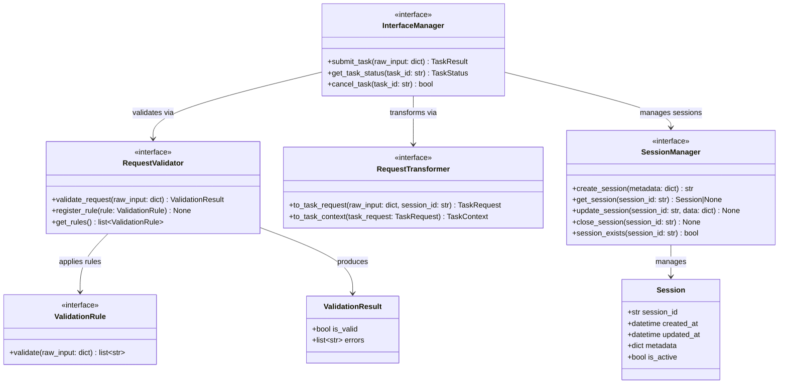

# AI Harness — Interface Layer Contracts

Location: `src/interfaces/interface_layer/`

**Responsibility:** Accept incoming task submissions, validate input, manage sessions, transform raw input into domain models, and delegate to the orchestrator. This is the system's entry point.

---

## 1. Contracts

### 1.1 `InterfaceManager`

**File:** `src/interfaces/interface_layer/interface_manager.py`

Top-level entry point. Accepts task submissions, delegates validation, manages sessions, transforms input, and calls the orchestrator.

| Method | Signature | Description |
|--------|-----------|-------------|
| `submit_task` | `(raw_input: dict[str, Any]) -> TaskResult` | Accept raw input, validate, transform, orchestrate, and return result |
| `get_task_status` | `(task_id: str) -> TaskStatus` | Query current status of a submitted task |
| `cancel_task` | `(task_id: str) -> bool` | Request cancellation of a running task |

**Dependencies (injected):**

- `RequestValidator`
- `SessionManager`
- `RequestTransformer`
- `Orchestrator`

---

### 1.2 `RequestValidator`

**File:** `src/interfaces/interface_layer/request_validator.py`

Validate incoming raw requests before transformation. Isolated to allow auth/policy plugins later.

| Method | Signature | Description |
|--------|-----------|-------------|
| `validate_request` | `(raw_input: dict[str, Any]) -> ValidationResult` | Validate raw input, return pass/fail with errors |
| `register_rule` | `(rule: ValidationRule) -> None` | Register a new validation rule |
| `get_rules` | `() -> list[ValidationRule]` | List registered validation rules |

**Supporting model — `ValidationResult`:**

| Attribute | Type | Description |
|-----------|------|-------------|
| `is_valid` | `bool` | Whether validation passed |
| `errors` | `list[str]` | List of validation error messages |

**Supporting model — `ValidationRule` (Protocol/ABC):**

| Method | Signature | Description |
|--------|-----------|-------------|
| `validate` | `(raw_input: dict[str, Any]) -> list[str]` | Return list of errors (empty = pass) |

---

### 1.3 `RequestTransformer`

**File:** `src/interfaces/interface_layer/request_transformer.py`

Transform validated raw input into domain `TaskRequest` and `TaskContext`.

| Method | Signature | Description |
|--------|-----------|-------------|
| `to_task_request` | `(raw_input: dict[str, Any], session_id: str) -> TaskRequest` | Transform raw input into a TaskRequest |
| `to_task_context` | `(task_request: TaskRequest) -> TaskContext` | Create initial TaskContext from TaskRequest |

---

### 1.4 `SessionManager`

**File:** `src/interfaces/interface_layer/session_manager.py`

Manage session lifecycle. Abstracted for future persistence backends.

| Method | Signature | Description |
|--------|-----------|-------------|
| `create_session` | `(metadata: dict[str, Any] | None = None) -> str` | Create a new session, return session_id |
| `get_session` | `(session_id: str) -> Session | None` | Retrieve session by ID |
| `update_session` | `(session_id: str, data: dict[str, Any]) -> None` | Update session data |
| `close_session` | `(session_id: str) -> None` | Mark session as closed |
| `session_exists` | `(session_id: str) -> bool` | Check if session exists |

**Supporting model — `Session`:**

| Attribute | Type | Description |
|-----------|------|-------------|
| `session_id` | `str` | Unique session identifier |
| `created_at` | `datetime` | Session creation timestamp |
| `updated_at` | `datetime` | Last activity timestamp |
| `metadata` | `dict[str, Any]` | Session metadata |
| `is_active` | `bool` | Whether session is still active |

---

## 2. Execution Flow

```text
submit_task(raw_input)
  -> RequestValidator.validate_request(raw_input)
  -> SessionManager.create_session() / get_session()
  -> RequestTransformer.to_task_request(raw_input, session_id)
  -> RequestTransformer.to_task_context(task_request)
  -> Orchestrator.execute_task(task_request, task_context)
  -> return TaskResult
```

---

## 3. Class Diagram


