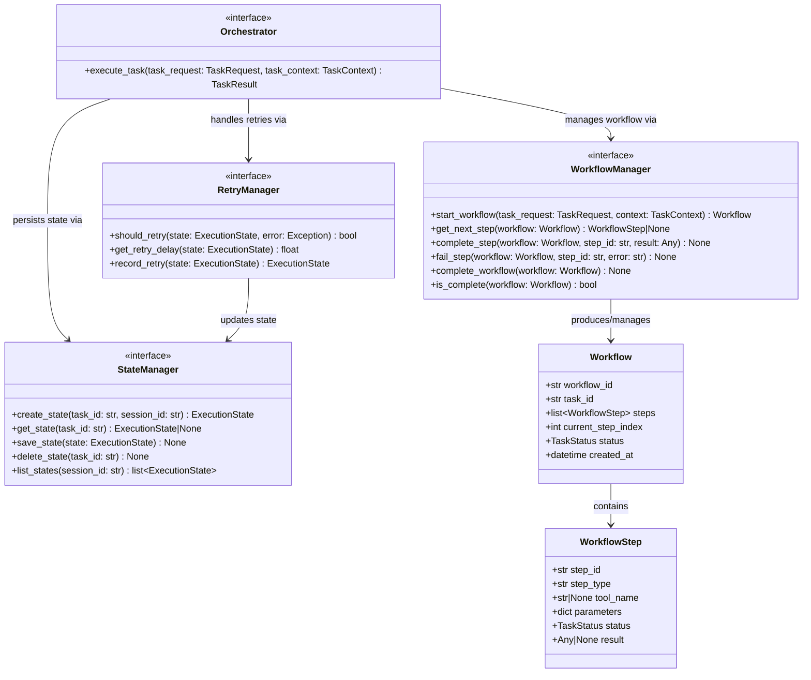

# AI Harness — Orchestration Layer Contracts

Location: `ai_harness/interfaces/orchestration/`

**Responsibility:** Coordinate the full task lifecycle — initialize state, assemble context, manage workflow steps, invoke tools, persist state, and emit events. This is the main application service layer.

---

## 1. Contracts

### 1.1 `Orchestrator`

**File:** `ai_harness/interfaces/orchestration/orchestrator.py`

Main application service. Coordinates state, context, workflow, tools, memory, and observability for task execution.

| Method | Signature | Description |
|--------|-----------|-------------|
| `execute_task` | `(task_request: TaskRequest, task_context: TaskContext) -> TaskResult` | Execute a task end-to-end |

**Dependencies (injected):**

- `StateManager`
- `ContextAssembler`
- `WorkflowManager`
- `ToolExecutor`
- `MemoryService`
- `ObservationManager`

---

### 1.2 `WorkflowManager`

**File:** `ai_harness/interfaces/orchestration/workflow_manager.py`

Manage workflow lifecycle — determine steps, transitions, and completion. Phase 1 is sequential; the contract supports future planner-backed workflows.

| Method | Signature | Description |
|--------|-----------|-------------|
| `start_workflow` | `(task_request: TaskRequest, context: TaskContext) -> Workflow` | Initialize a workflow for a task |
| `get_next_step` | `(workflow: Workflow) -> WorkflowStep | None` | Get the next step to execute (None = done) |
| `complete_step` | `(workflow: Workflow, step_id: str, result: Any) -> None` | Mark a step as completed with its result |
| `fail_step` | `(workflow: Workflow, step_id: str, error: str) -> None` | Mark a step as failed |
| `complete_workflow` | `(workflow: Workflow) -> None` | Mark the entire workflow as complete |
| `is_complete` | `(workflow: Workflow) -> bool` | Check if workflow is finished |

**Supporting model — `Workflow`:**

| Attribute | Type | Description |
|-----------|------|-------------|
| `workflow_id` | `str` | Unique workflow identifier |
| `task_id` | `str` | Associated task identifier |
| `steps` | `list[WorkflowStep]` | Ordered list of steps |
| `current_step_index` | `int` | Index of current step |
| `status` | `TaskStatus` | Workflow status |
| `created_at` | `datetime` | Creation timestamp |

**Supporting model — `WorkflowStep`:**

| Attribute | Type | Description |
|-----------|------|-------------|
| `step_id` | `str` | Unique step identifier |
| `step_type` | `str` | Type of step (e.g., "tool_call", "transform") |
| `tool_name` | `str | None` | Tool to invoke (if step_type is tool_call) |
| `parameters` | `dict[str, Any]` | Step parameters |
| `status` | `TaskStatus` | Step status |
| `result` | `Any | None` | Step result once complete |

---

### 1.3 `StateManager`

**File:** `ai_harness/interfaces/orchestration/state_manager.py`

Persist and retrieve execution state. Backend-neutral public API.

| Method | Signature | Description |
|--------|-----------|-------------|
| `create_state` | `(task_id: str, session_id: str) -> ExecutionState` | Create initial execution state |
| `get_state` | `(task_id: str) -> ExecutionState | None` | Retrieve state by task ID |
| `save_state` | `(state: ExecutionState) -> None` | Persist current state |
| `delete_state` | `(task_id: str) -> None` | Remove state (cleanup) |
| `list_states` | `(session_id: str) -> list[ExecutionState]` | List all states for a session |

---

### 1.4 `RetryManager`

**File:** `ai_harness/interfaces/orchestration/retry_manager.py`

Encapsulate retry logic. Prevents retry concerns from leaking into tool execution or orchestration.

| Method | Signature | Description |
|--------|-----------|-------------|
| `should_retry` | `(state: ExecutionState, error: Exception) -> bool` | Determine if a retry should be attempted |
| `get_retry_delay` | `(state: ExecutionState) -> float` | Get delay in seconds before next retry |
| `record_retry` | `(state: ExecutionState) -> ExecutionState` | Update state to reflect retry attempt |

---

## 2. Execution Flow

```text
Orchestrator.execute_task(task_request, task_context)
  -> StateManager.create_state(task_id, session_id)
  -> StateManager.save_state(state)  [status=RUNNING]
  -> ContextAssembler.assemble_context(task_request, session_id)
  -> WorkflowManager.start_workflow(task_request, context)
  -> LOOP:
       -> WorkflowManager.get_next_step(workflow)
       -> ToolExecutor.execute(tool_request)
       -> ContextAssembler.update_context(context, tool_result)
       -> MemoryService.store(...)
       -> WorkflowManager.complete_step(workflow, step_id, result)
       -> ObservationManager.record_event(...)
       -> ObservationManager.record_metric(...)
  -> WorkflowManager.complete_workflow(workflow)
  -> StateManager.save_state(state)  [status=COMPLETED]
  -> return TaskResult
```

---

## 3. Class Diagram


