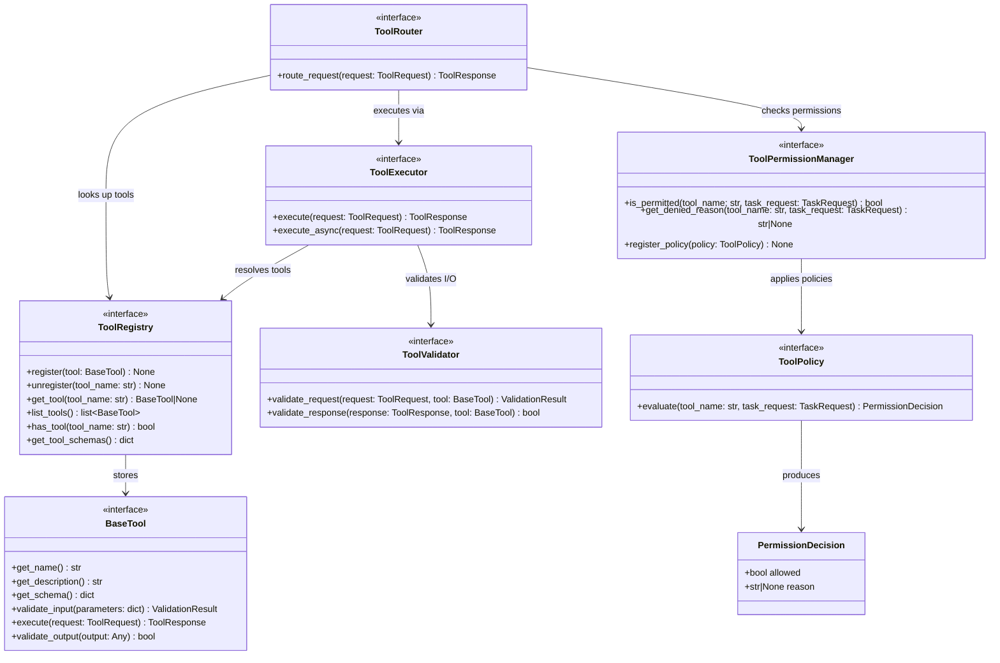

# AI Harness — Tool Layer Contracts

Location: `src/interfaces/tools/`

**Responsibility:** Define the plugin-based tool system. Tools register via a registry, are validated and permission-checked before execution, and always return normalized `ToolResponse` objects.

---

## 1. Contracts

### 1.1 `BaseTool`

**File:** `src/interfaces/tools/base_tool.py`

Abstract base for all tool implementations. Every tool exposes metadata, validation, and execution.

| Method | Signature | Description |
|--------|-----------|-------------|
| `get_name` | `() -> str` | Return unique tool name |
| `get_description` | `() -> str` | Return human-readable tool description |
| `get_schema` | `() -> dict[str, Any]` | Return JSON Schema of expected input parameters |
| `validate_input` | `(parameters: dict[str, Any]) -> ValidationResult` | Validate input parameters against schema |
| `execute` | `(request: ToolRequest) -> ToolResponse` | Execute the tool and return normalized response |
| `validate_output` | `(output: Any) -> bool` | Validate output meets expected shape |

**Properties:**

| Property | Type | Description |
|----------|------|-------------|
| `name` | `str` | Tool name (delegates to `get_name()`) |
| `description` | `str` | Tool description (delegates to `get_description()`) |
| `schema` | `dict[str, Any]` | Tool schema (delegates to `get_schema()`) |

---

### 1.2 `ToolRegistry`

**File:** `src/interfaces/tools/tool_registry.py`

Registry-based tool discovery. Clean path to dynamic plugin loading.

| Method | Signature | Description |
|--------|-----------|-------------|
| `register` | `(tool: BaseTool) -> None` | Register a tool instance |
| `unregister` | `(tool_name: str) -> None` | Remove a tool from registry |
| `get_tool` | `(tool_name: str) -> BaseTool | None` | Retrieve a tool by name |
| `list_tools` | `() -> list[BaseTool]` | List all registered tools |
| `has_tool` | `(tool_name: str) -> bool` | Check if a tool is registered |
| `get_tool_schemas` | `() -> dict[str, dict[str, Any]]` | Return all tool schemas keyed by name |

---

### 1.3 `ToolExecutor`

**File:** `src/interfaces/tools/tool_executor.py`

Execute tools with proper error mapping and result normalization.

| Method | Signature | Description |
|--------|-----------|-------------|
| `execute` | `(request: ToolRequest) -> ToolResponse` | Execute a tool synchronously, normalize result |
| `execute_async` | `(request: ToolRequest) -> Awaitable[ToolResponse]` | Async extension point for future use |

**Dependencies (injected):**

- `ToolRegistry`
- `ToolValidator`
- `ToolPermissionManager`
- `ObservationManager`

---

### 1.4 `ToolValidator`

**File:** `src/interfaces/tools/tool_validator.py`

Validate tool input/output separately from routing and execution logic.

| Method | Signature | Description |
|--------|-----------|-------------|
| `validate_request` | `(request: ToolRequest, tool: BaseTool) -> ValidationResult` | Validate parameters against the tool's schema |
| `validate_response` | `(response: ToolResponse, tool: BaseTool) -> bool` | Validate output meets tool's output expectations |

---

### 1.5 `ToolPermissionManager`

**File:** `src/interfaces/tools/tool_permission_manager.py`

Gate tool execution with permission checks. Phase 1 is permissive; the boundary exists for future policy enforcement.

| Method | Signature | Description |
|--------|-----------|-------------|
| `is_permitted` | `(tool_name: str, task_request: TaskRequest) -> bool` | Check if a tool is allowed for this task/context |
| `get_denied_reason` | `(tool_name: str, task_request: TaskRequest) -> str | None` | Get denial reason if not permitted |
| `register_policy` | `(policy: ToolPolicy) -> None` | Register a permission policy |

**Supporting model — `ToolPolicy` (Protocol/ABC):**

| Method | Signature | Description |
|--------|-----------|-------------|
| `evaluate` | `(tool_name: str, task_request: TaskRequest) -> PermissionDecision` | Evaluate tool permission |

**Supporting model — `PermissionDecision`:**

| Attribute | Type | Description |
|-----------|------|-------------|
| `allowed` | `bool` | Whether execution is permitted |
| `reason` | `str | None` | Reason for denial (if denied) |

---

### 1.6 `ToolRouter`

**File:** `src/interfaces/tools/tool_router.py`

Route a tool request to the appropriate tool and executor. Decouples orchestration from direct tool lookup.

| Method | Signature | Description |
|--------|-----------|-------------|
| `route_request` | `(request: ToolRequest) -> ToolResponse` | Route and execute the tool request |

**Dependencies (injected):**

- `ToolRegistry`
- `ToolExecutor`
- `ToolPermissionManager`

---

## 2. Phase 1 MVP Tools

| Tool | Description |
|------|-------------|
| `FilesystemTool` | Read/write/list files |
| `SearchTool` | Search content across files |
| Mock/demo tool | Deterministic tool for testing |

---

## 3. Execution Flow

```text
ToolRouter.route_request(tool_request)
  -> ToolRegistry.get_tool(tool_name)
  -> ToolPermissionManager.is_permitted(tool_name, task_request)
  -> ToolValidator.validate_request(request, tool)
  -> tool.execute(request)
  -> ToolValidator.validate_response(response, tool)
  -> return ToolResponse
```

---

## 4. Class Diagram


