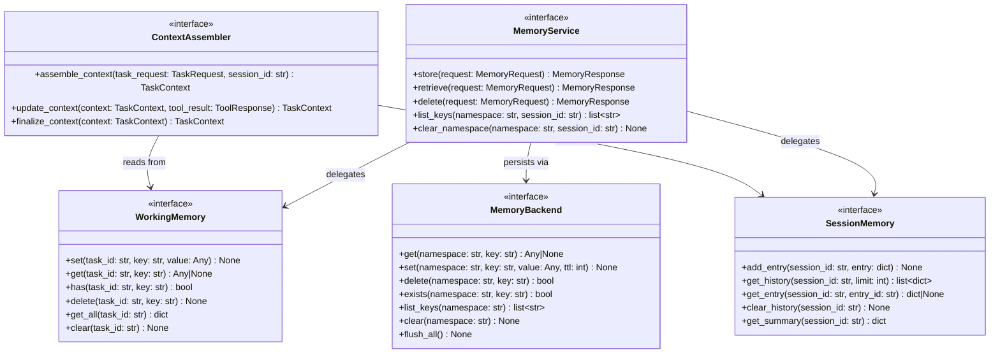

# AI Harness — Memory Layer Contracts

Location: `src/interfaces/memory/`

**Responsibility:** Provide unified memory access for the orchestration layer. Manages working memory (per-task transient), session memory (cross-task history), and a pluggable storage backend. The `ContextAssembler` combines all sources into a single `TaskContext`.

---

## 1. Contracts

### 1.1 `MemoryService`

**File:** `src/interfaces/memory/memory_service.py`

The only orchestration-facing memory contract. Provides a unified interface over working memory, session memory, and any future backends.

| Method | Signature | Description |
|--------|-----------|-------------|
| `store` | `(request: MemoryRequest) -> MemoryResponse` | Store a value in the specified namespace |
| `retrieve` | `(request: MemoryRequest) -> MemoryResponse` | Retrieve a value from memory |
| `delete` | `(request: MemoryRequest) -> MemoryResponse` | Delete a value from memory |
| `list_keys` | `(namespace: str, session_id: str) -> list[str]` | List all keys in a namespace for a session |
| `clear_namespace` | `(namespace: str, session_id: str) -> None` | Clear all entries in a namespace for a session |

**Dependencies (injected):**

- `WorkingMemory`
- `SessionMemory`
- `MemoryBackend`

---

### 1.2 `WorkingMemory`

**File:** `src/interfaces/memory/working_memory.py`

Transient execution data for a single task run. Cleared when the task completes.

| Method | Signature | Description |
|--------|-----------|-------------|
| `set` | `(task_id: str, key: str, value: Any) -> None` | Store a transient value for a task |
| `get` | `(task_id: str, key: str) -> Any | None` | Retrieve a transient value |
| `has` | `(task_id: str, key: str) -> bool` | Check if a key exists for a task |
| `delete` | `(task_id: str, key: str) -> None` | Delete a transient value |
| `get_all` | `(task_id: str) -> dict[str, Any]` | Get all working memory for a task |
| `clear` | `(task_id: str) -> None` | Clear all working memory for a task |

---

### 1.3 `SessionMemory`

**File:** `src/interfaces/memory/session_memory.py`

Short conversational/task history across a session. Persists beyond a single task.

| Method | Signature | Description |
|--------|-----------|-------------|
| `add_entry` | `(session_id: str, entry: dict[str, Any]) -> None` | Add a history entry |
| `get_history` | `(session_id: str, limit: int | None = None) -> list[dict[str, Any]]` | Retrieve session history (most recent first) |
| `get_entry` | `(session_id: str, entry_id: str) -> dict[str, Any] | None` | Retrieve a specific history entry |
| `clear_history` | `(session_id: str) -> None` | Clear all session history |
| `get_summary` | `(session_id: str) -> dict[str, Any]` | Get a summary of the session (task count, last activity, etc.) |

---

### 1.4 `ContextAssembler`

**File:** `src/interfaces/memory/context_assembler.py`

Combine request payload, session history, working memory, and recent tool results into a unified `TaskContext`. The orchestration layer depends on this, not on individual memory stores.

| Method | Signature | Description |
|--------|-----------|-------------|
| `assemble_context` | `(task_request: TaskRequest, session_id: str) -> TaskContext` | Assemble full execution context from all sources |
| `update_context` | `(context: TaskContext, tool_result: ToolResponse) -> TaskContext` | Update context with new tool result |
| `finalize_context` | `(context: TaskContext) -> TaskContext` | Finalize context at end of execution (snapshot) |

**Dependencies (injected):**

- `WorkingMemory`
- `SessionMemory`
- `MemoryService`

---

### 1.5 `MemoryBackend`

**File:** `src/interfaces/memory/memory_backend.py`

Low-level storage abstraction. Phase 1 is in-memory; the contract supports Redis/Postgres/vector backends as future drop-in replacements.

| Method | Signature | Description |
|--------|-----------|-------------|
| `get` | `(namespace: str, key: str) -> Any | None` | Get a value by namespace and key |
| `set` | `(namespace: str, key: str, value: Any, ttl_seconds: int | None = None) -> None` | Set a value with optional TTL |
| `delete` | `(namespace: str, key: str) -> bool` | Delete a value, return True if existed |
| `exists` | `(namespace: str, key: str) -> bool` | Check if a key exists |
| `list_keys` | `(namespace: str) -> list[str]` | List all keys in a namespace |
| `clear` | `(namespace: str) -> None` | Clear all entries in a namespace |
| `flush_all` | `() -> None` | Clear all data (testing/reset only) |

---

## 2. Execution Flow

```text
ContextAssembler.assemble_context(task_request, session_id)
  -> SessionMemory.get_history(session_id)
  -> WorkingMemory.get_all(task_id)
  -> Combines: request payload + history + working memory
  -> Returns: TaskContext

MemoryService.store(memory_request)
  -> Routes to WorkingMemory or SessionMemory based on namespace
  -> MemoryBackend.set(namespace, key, value, ttl)
  -> Returns: MemoryResponse
```

---

## 3. Class Diagram


