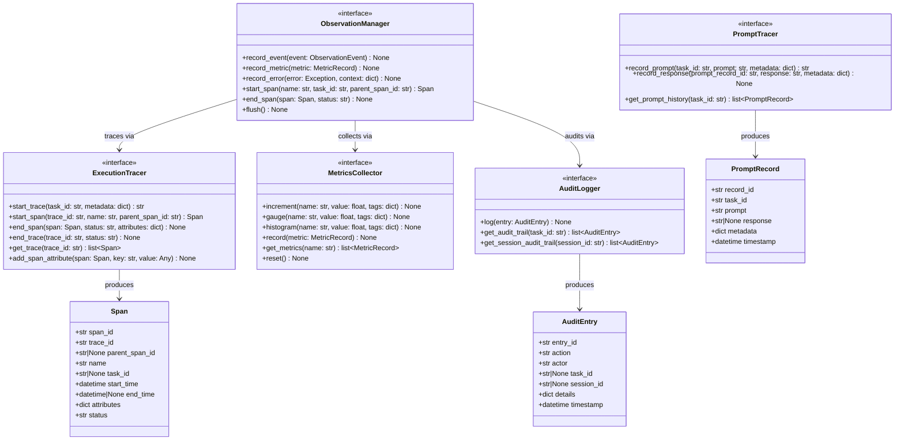

# AI Harness — Observability Layer Contracts

Location: `ai_harness/interfaces/observability/`

**Responsibility:** Single entry point for all observability — events, metrics, traces, prompt tracking, and audit logging. All components emit through `ObservationManager`. Designed for future OpenTelemetry integration.

---

## 1. Contracts

### 1.1 `ObservationManager`

**File:** `ai_harness/interfaces/observability/observation_manager.py`

Single entry point for recording all observability data. All other components emit through this interface.

| Method | Signature | Description |
|--------|-----------|-------------|
| `record_event` | `(event: ObservationEvent) -> None` | Record an observability event |
| `record_metric` | `(metric: MetricRecord) -> None` | Record a metric data point |
| `record_error` | `(error: Exception, context: dict[str, Any] | None = None) -> None` | Record an error with optional context |
| `start_span` | `(name: str, task_id: str | None = None, parent_span_id: str | None = None) -> Span` | Start a new trace span |
| `end_span` | `(span: Span, status: str = "ok") -> None` | End a trace span |
| `flush` | `() -> None` | Flush any buffered observability data |

**Dependencies (injected):**

- `ExecutionTracer`
- `MetricsCollector`
- `AuditLogger`

---

### 1.2 `ExecutionTracer`

**File:** `ai_harness/interfaces/observability/execution_tracer.py`

Represent task execution as trace/span-style events. Designed for future OpenTelemetry integration.

| Method | Signature | Description |
|--------|-----------|-------------|
| `start_trace` | `(task_id: str, metadata: dict[str, Any] | None = None) -> str` | Start a new trace, return trace_id |
| `start_span` | `(trace_id: str, name: str, parent_span_id: str | None = None) -> Span` | Create a span within a trace |
| `end_span` | `(span: Span, status: str = "ok", attributes: dict[str, Any] | None = None) -> None` | End a span with status and optional attributes |
| `end_trace` | `(trace_id: str, status: str = "ok") -> None` | End a trace |
| `get_trace` | `(trace_id: str) -> list[Span]` | Retrieve all spans for a trace |
| `add_span_attribute` | `(span: Span, key: str, value: Any) -> None` | Add an attribute to an active span |

---

### 1.3 `PromptTracer`

**File:** `ai_harness/interfaces/observability/prompt_tracer.py`

Track prompt/response pairs for debugging and evaluation. Contract defined now; implementation minimal in Phase 1.

| Method | Signature | Description |
|--------|-----------|-------------|
| `record_prompt` | `(task_id: str, prompt: str, metadata: dict[str, Any] | None = None) -> str` | Record a prompt, return prompt_record_id |
| `record_response` | `(prompt_record_id: str, response: str, metadata: dict[str, Any] | None = None) -> None` | Record the response to a prompt |
| `get_prompt_history` | `(task_id: str) -> list[PromptRecord]` | Retrieve all prompt/response pairs for a task |

---

### 1.4 `MetricsCollector`

**File:** `ai_harness/interfaces/observability/metrics_collector.py`

Collect and expose metrics.

| Method | Signature | Description |
|--------|-----------|-------------|
| `increment` | `(name: str, value: float = 1.0, tags: dict[str, str] | None = None) -> None` | Increment a counter metric |
| `gauge` | `(name: str, value: float, tags: dict[str, str] | None = None) -> None` | Set a gauge metric |
| `histogram` | `(name: str, value: float, tags: dict[str, str] | None = None) -> None` | Record a histogram value |
| `record` | `(metric: MetricRecord) -> None` | Record a pre-built metric |
| `get_metrics` | `(name: str | None = None) -> list[MetricRecord]` | Retrieve recorded metrics (optionally filtered) |
| `reset` | `() -> None` | Reset all collected metrics (testing) |

**Phase 1 metrics:**

| Metric Name | Type | Description |
|-------------|------|-------------|
| `task.submitted` | COUNTER | Total tasks submitted |
| `task.completed` | COUNTER | Tasks completed successfully |
| `task.failed` | COUNTER | Tasks that failed |
| `task.execution.duration_ms` | HISTOGRAM | Task execution latency |
| `tool.call.count` | COUNTER | Total tool invocations |
| `tool.call.duration_ms` | HISTOGRAM | Tool execution latency |
| `tool.call.failed` | COUNTER | Failed tool invocations |
| `retry.count` | COUNTER | Total retries attempted |

---

### 1.5 `AuditLogger`

**File:** `ai_harness/interfaces/observability/audit_logger.py`

Structured audit logging for compliance and debugging.

| Method | Signature | Description |
|--------|-----------|-------------|
| `log` | `(entry: AuditEntry) -> None` | Record an audit log entry |
| `get_audit_trail` | `(task_id: str) -> list[AuditEntry]` | Retrieve audit trail for a task |
| `get_session_audit_trail` | `(session_id: str) -> list[AuditEntry]` | Retrieve audit trail for a session |

**Phase 1 audit events:**

- `task_submitted` — when a new task is accepted
- `task_started` — when execution begins
- `tool_executed` — when a tool is invoked (include tool name, duration)
- `task_completed` — when task finishes successfully
- `task_failed` — when task fails (include error details)
- `retry_attempted` — when a retry is triggered

---

## 2. Supporting Models

### `Span`

| Attribute | Type | Description |
|-----------|------|-------------|
| `span_id` | `str` | Unique span identifier |
| `trace_id` | `str` | Parent trace identifier |
| `parent_span_id` | `str | None` | Parent span (for nested spans) |
| `name` | `str` | Span name/label |
| `task_id` | `str | None` | Associated task identifier |
| `start_time` | `datetime` | Span start timestamp |
| `end_time` | `datetime | None` | Span end timestamp (None until ended) |
| `attributes` | `dict[str, Any]` | Span attributes |
| `status` | `str` | Span status ("ok", "error") |

### `PromptRecord`

| Attribute | Type | Description |
|-----------|------|-------------|
| `record_id` | `str` | Unique record identifier |
| `task_id` | `str` | Associated task identifier |
| `prompt` | `str` | The prompt text |
| `response` | `str | None` | The response text (None until recorded) |
| `metadata` | `dict[str, Any]` | Additional metadata (model, tokens, etc.) |
| `timestamp` | `datetime` | Record timestamp |

### `AuditEntry`

| Attribute | Type | Description |
|-----------|------|-------------|
| `entry_id` | `str` | Unique audit entry identifier |
| `action` | `str` | Action performed (e.g., "task_submitted", "tool_executed") |
| `actor` | `str` | Component/service that performed the action |
| `task_id` | `str | None` | Associated task identifier |
| `session_id` | `str | None` | Associated session identifier |
| `details` | `dict[str, Any]` | Action details/payload |
| `timestamp` | `datetime` | Action timestamp |

---

## 3. Class Diagram

