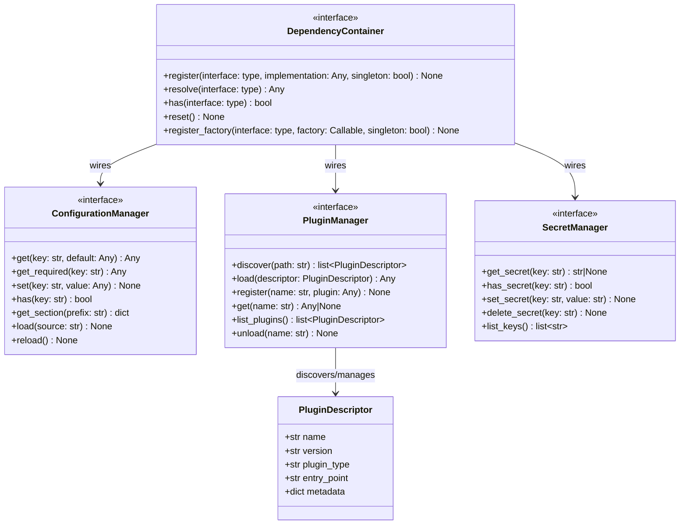

# AI Harness — Cross-cutting Platform Services

Location: `ai_harness/interfaces/platform/`

**Responsibility:** Light abstractions for configuration, plugin management, dependency injection, and secret handling. These exist in the MVP to keep the system wirable and extensible from day one.

---

## 1. Contracts

### 1.1 `ConfigurationManager`

**File:** `ai_harness/interfaces/platform/configuration_manager.py`

Centralized configuration access. Supports hierarchical keys, defaults, and future hot-reload.

| Method | Signature | Description |
|--------|-----------|-------------|
| `get` | `(key: str, default: Any = None) -> Any` | Get a configuration value by key |
| `get_required` | `(key: str) -> Any` | Get a required value (raises if missing) |
| `set` | `(key: str, value: Any) -> None` | Set a configuration value |
| `has` | `(key: str) -> bool` | Check if a key exists |
| `get_section` | `(prefix: str) -> dict[str, Any]` | Get all keys under a prefix as a dict |
| `load` | `(source: str) -> None` | Load configuration from a source (file, env, etc.) |
| `reload` | `() -> None` | Reload configuration from all sources |

---

### 1.2 `PluginManager`

**File:** `ai_harness/interfaces/platform/plugin_manager.py`

Discover, load, and manage plugins (tools, memory backends, observers). Supports the "plugins everywhere" design principle.

| Method | Signature | Description |
|--------|-----------|-------------|
| `discover` | `(path: str) -> list[PluginDescriptor]` | Discover plugins at a given path |
| `load` | `(descriptor: PluginDescriptor) -> Any` | Load and instantiate a plugin |
| `register` | `(name: str, plugin: Any) -> None` | Manually register a plugin instance |
| `get` | `(name: str) -> Any | None` | Get a registered plugin by name |
| `list_plugins` | `() -> list[PluginDescriptor]` | List all discovered/registered plugins |
| `unload` | `(name: str) -> None` | Unload a plugin |

---

### 1.3 `DependencyContainer`

**File:** `ai_harness/interfaces/platform/dependency_container.py`

Simple dependency injection container. Wires interfaces to implementations at bootstrap time.

| Method | Signature | Description |
|--------|-----------|-------------|
| `register` | `(interface: type, implementation: Any, singleton: bool = True) -> None` | Register an implementation for an interface |
| `resolve` | `(interface: type) -> Any` | Resolve an interface to its registered implementation |
| `has` | `(interface: type) -> bool` | Check if an interface has a registered implementation |
| `reset` | `() -> None` | Clear all registrations (testing) |
| `register_factory` | `(interface: type, factory: Callable[[], Any], singleton: bool = True) -> None` | Register a factory for lazy instantiation |

---

### 1.4 `SecretManager`

**File:** `ai_harness/interfaces/platform/secret_manager.py`

Interface for retrieving secrets. Defined now; implemented when external services are introduced.

| Method | Signature | Description |
|--------|-----------|-------------|
| `get_secret` | `(key: str) -> str | None` | Retrieve a secret value by key |
| `has_secret` | `(key: str) -> bool` | Check if a secret exists |
| `set_secret` | `(key: str, value: str) -> None` | Store a secret (for local/dev use) |
| `delete_secret` | `(key: str) -> None` | Delete a secret |
| `list_keys` | `() -> list[str]` | List available secret keys (not values) |

---

## 2. Supporting Models

### `PluginDescriptor`

| Attribute | Type | Description |
|-----------|------|-------------|
| `name` | `str` | Plugin unique name |
| `version` | `str` | Plugin version |
| `plugin_type` | `str` | Plugin type (e.g., "tool", "memory_backend", "observer") |
| `entry_point` | `str` | Module/class entry point |
| `metadata` | `dict[str, Any]` | Additional plugin metadata |

---

## 3. Bootstrap Flow

```text
Application startup:
  -> ConfigurationManager.load("config.yaml")
  -> DependencyContainer.register(MemoryBackend, InMemoryBackend)
  -> DependencyContainer.register(StateManager, InMemoryStateManager)
  -> DependencyContainer.register(...)
  -> PluginManager.discover("plugins/")
  -> PluginManager.load(each descriptor)
  -> ToolRegistry.register(each tool plugin)
  -> Application ready
```

---

## 4. Class Diagram


